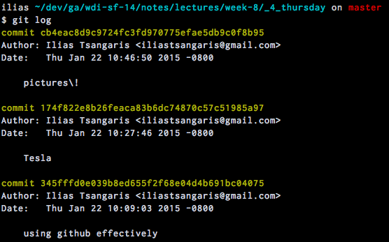
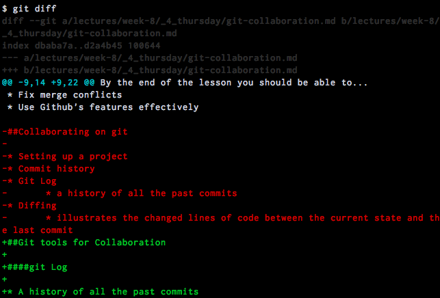
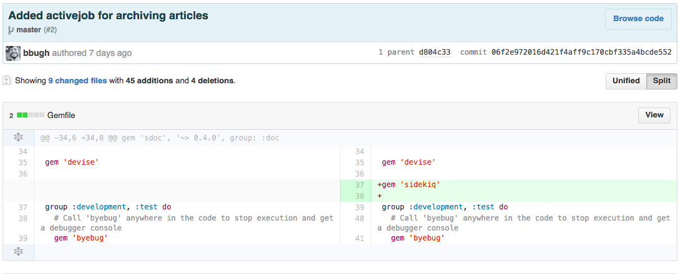
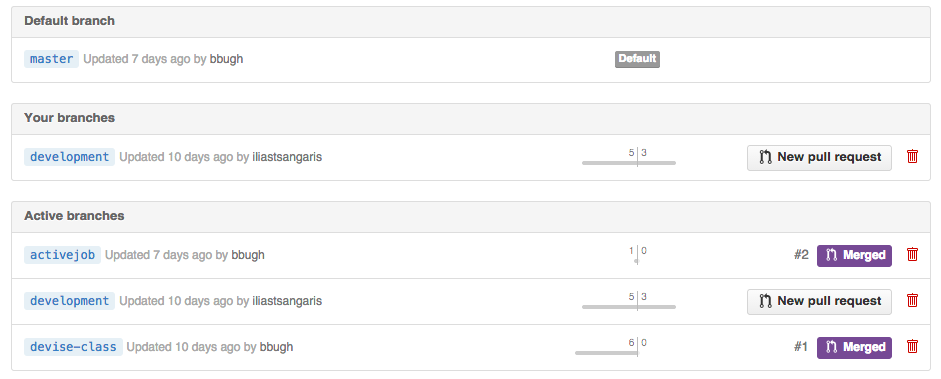
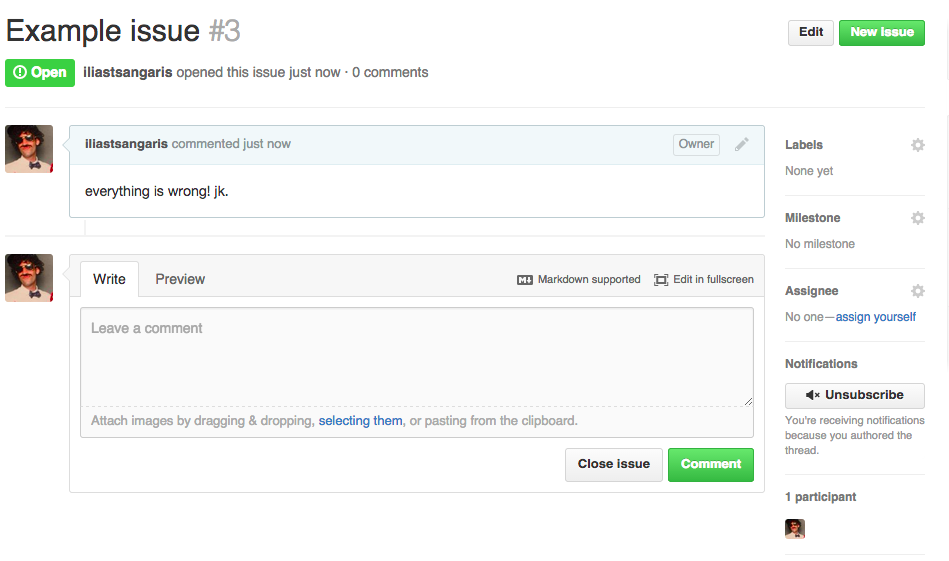
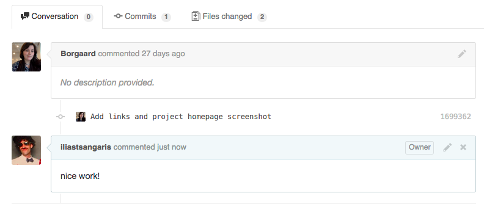
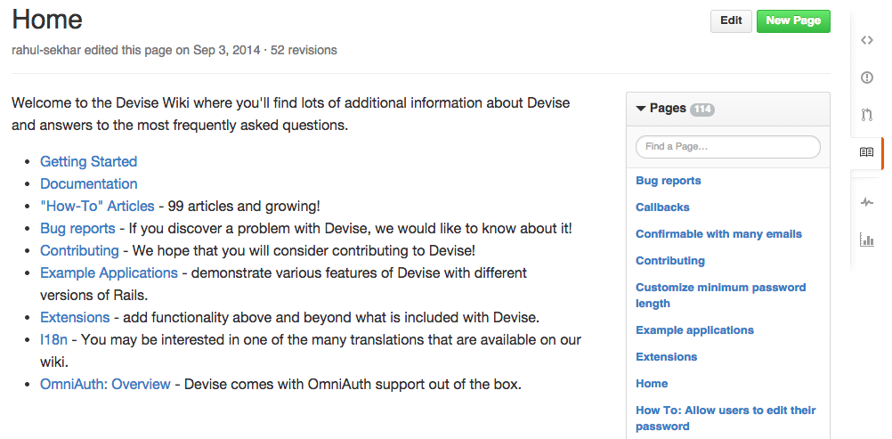

#Git Collaboration

##Learning Objectives
By the end of the lesson you should be able to...


* Collaborate on a git project
* Use feature branches appropriately
* Fix merge conflicts
* Use Github's features effectively

##Git tools for Collaboration

####git log

* Displays all the past commits
* Useful for viewing previous code changes and a list of individual contributions




####git diff

* Illustrates the changed lines of code between the current state and the last commit




##Feature Branching

Think about Elon Musk designing a car at Tesla

* There exists a 2014 master Tesla
* Elon wants to build a 2015 concept Tesla
* In order to preserve the master, he decides that it's better to copy the master than directly modify it
* Once copied Elon can feel free to iterate without any destructive consequences as he will now always be able to revert back to the existing 2014 master
* Once Elon is satisfied he can merge the concept features into a new 2015 master Tesla

in other words...

* A branch represents an independent line of development
* New features should be developed in a branch of the repository
* Once the feature is complete & working it can be merged into the main repository
* Commands
	* `git branch <branch_name>` — creates a new branch
	* `git checkout <branch_name>` — jumps into a specified branch
	* `git merge <branch_name> master` — merges a branch into master

##Merge Conflicts

* Occurs when there are disagreeing changes between your code and a previous commit
* This needs to be resolved before you can commit your code

Example conflict:

```
the number of planets are
<<<<<<< HEAD
nine
=======
eight
>>>>>>> branch-a
```

##Using Github Effectively

####Blaming

* Points out who change which lines in a file, showing the commit message

[Example](https://github.com/sf-wdi-14/rails-review/blame/master/app/controllers/articles_controller.rb)


####Diffing (again)

* Displays the changed lines of code in a set of files or file

[Example](https://github.com/sf-wdi-14/rails-review/commit/06f2e972016d421f4aff9c170cbf335a4bcde552)



####History

* Shows readable history of all git commits and merges

[Example](https://github.com/sf-wdi-14/rails-review/commits/master)


####Branches

* Enables one to view all the branches in a repository
* Again, branching is ideal for collaborating between individuals on team

[Example](https://github.com/sf-wdi-14/rails-review/branches)




####Forking

* Creates a remote clone that you now own which you can make changes to
* This is particularly useful for open source projects
* Forking is great for collaborating between separate teams 

####Pull Requests

* Used to request that a forked repository is merged or "pulled" into its associated upstream repository
* This allows the upstream repository owner the discretion of which forks can be merged
* Enables one to safely and freely submit code to any public repository

[Example](https://github.com/sf-wdi-14/notes/pulls)


####Issues

* Anyone can submit an issue for a public repo that the owner will be made aware of
* Issues are open by anyone if they have identified a problem in the code
* Issues are closed by the project owner once the problem is solved

[Example](https://github.com/sf-wdi-14/rails-review/issues)



####Comments

* At the bottom of a specific commit, issue, or pull request you may leave a comment and @mention a user

[Example](https://github.com/sf-wdi-14/notes/pull/82)




####Wiki

* Typically used for more advanced documentation for your library; aka an expanded readme
* Also keep in mind, you can use it for whatever suits your needs best

[Divise's Wiki](https://github.com/plataformatec/devise/wiki)




##Additional Resources

* [Become a git guru](https://www.atlassian.com/git/tutorials/)
* [How Git Works Video Overview](https://www.youtube.com/watch?v=1ffBJ4sVUb4)
* [Git deep-dive](http://think-like-a-git.net/)
